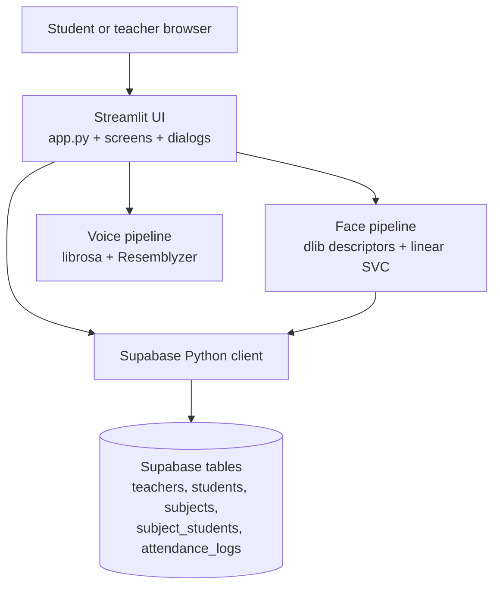

# SnapClass – AI-Powered Attendance System

> A biometric attendance management platform that automates classroom
> attendance using facial recognition and speaker identification technologies.

[](https://www.python.org/)
[](https://streamlit.io/)
[](https://supabase.com/)
[](https://scikit-learn.org/)
[](http://dlib.net/)
[](https://github.com/resemble-ai/Resemblyzer)

SnapClass is a Streamlit application for real-world classroom automation.
Teachers create subjects, share join links, and record attendance from
classroom photos or audio. Students create a biometric profile with a camera
photo and optionally a voice sample, then use recognition-based sign-in and
review their attendance.

## Table of contents

- [Screenshots](#screenshots)
- [Technical features](#technical-features)
- [System architecture](#system-architecture)
- [Key technical achievements](#key-technical-achievements)
- [Technology](#technology)
- [Repository layout](#repository-layout)
- [Prerequisites](#prerequisites)
- [Installation](#installation)
- [Configuration](#configuration)
- [Supabase data model](#supabase-data-model)
- [Running locally](#running-locally)
- [Recognition behavior](#recognition-behavior)
- [Application routes and links](#application-routes-and-links)
- [Deployment](#deployment)
- [Security and operational notes](#security-and-operational-notes)
- [Future enhancements](#future-enhancements)
- [Contributing](#contributing)
- [License](#license)

## Screenshots

The repository currently contains no checked-in screenshots. Add product captures
to `docs/screenshots/` and replace the placeholders below before publishing a
visual case study.

| Student portal | Teacher attendance |
| --- | --- |
|  |  |

| Subject management | Attendance analytics |
| --- | --- |
|  |  |

## Technical features

- Separate student and teacher portals.
- Teacher registration and password login.
- Student profile registration from a camera image.
- Optional student voice-profile enrollment.
- Face-based student recognition using classroom photos.
- Voice-based attendance from segmented classroom audio.
- Subject creation, enrollment, unenrollment, and QR-code sharing.
- Attendance review before saving.
- Student attendance statistics and teacher attendance summaries.
- Supabase-backed persistence.

## System architecture



**Runtime flow**

1. `app.py` selects the home, teacher, or student experience using
   `st.session_state`.
2. Student camera/audio inputs create biometric embeddings or identify an
   existing student.
3. Teacher photo/audio inputs produce a reviewable attendance table.
4. Confirmed attendance is inserted into Supabase and later aggregated for
   student and teacher dashboards.

## Key technical achievements

- Built a dual-modality biometric workflow combining face recognition and
  speaker identification in one classroom product.
- Implemented runtime face-model training from persisted student embeddings
  using a balanced linear SVC and nearest-embedding verification.
- Added bulk voice processing that segments classroom audio, skips short
  segments, and retains the best speaker score per student.
- Designed a relational Supabase data model for teachers, students, subjects,
  enrollment, and attendance history.
- Added a human-review checkpoint before biometric results are persisted.
- Delivered a deployment-ready Streamlit entry point with secrets-based
  configuration and browser camera/microphone support.

## Technology

- **UI and runtime:** Python, Streamlit
- **Database/API client:** Supabase Python client
- **Face recognition:** dlib, `face_recognition_models`, NumPy, scikit-learn
- **Voice recognition:** Resemblyzer, librosa, NumPy
- **Authentication storage:** bcrypt password hashing
- **QR generation:** Segno
- **Data presentation:** pandas
- **Image handling:** Pillow

No external generative-AI model or LLM is used. The application uses local
computer-vision and speaker-embedding models:

- dlib's frontal-face detector, shape predictor, and face-recognition model
  supplied by `face_recognition_models`.
- A linear, probability-enabled scikit-learn `SVC` trained at runtime from the
  face embeddings stored for students.
- Resemblyzer's `VoiceEncoder`, loaded and cached by Streamlit.

## Repository layout

```text
.
├── app.py                         # Streamlit entry point and portal routing
├── requirements.txt               # Python dependencies
├── src/
│   ├── components/                # Headers, footers, cards, and dialogs
│   ├── database/
│   │   ├── config.py              # Supabase client initialization
│   │   └── db.py                  # Supabase data-access helpers
│   ├── pipelines/
│   │   ├── face_pipeline.py       # Face embeddings and face attendance
│   │   └── voice_pipeline.py      # Voice embeddings and speaker matching
│   ├── screens/
│   │   ├── home_screen.py         # Portal selection
│   │   ├── teacher_screen.py      # Teacher auth and dashboard
│   │   └── student_screen.py      # Student registration and dashboard
│   └── ui/
│       └── base_layout.py         # CSS and page styling
└── .gitignore
```

## Prerequisites

- Python 3.14 or a compatible Python version supported by the dependencies.
- A Supabase project with the tables and relationships described below.
- A browser that supports Streamlit camera and audio input for recognition
  workflows.

## Installation

```bash
git clone https://github.com/shreeshailsingare/snapclass.git
cd snapclass
python -m venv venv
```

Activate the virtual environment:

```bash
# Windows PowerShell
.\venv\Scripts\Activate.ps1

# macOS/Linux
source venv/bin/activate
```

Install the dependencies:

```bash
python -m pip install --upgrade pip
pip install -r requirements.txt
```

The dependency list includes the GitHub-hosted
`face_recognition_models` package and `setuptools<70.0.0`, in addition to the
runtime libraries listed above.

The declared packages are:

```text
streamlit
numpy
pandas
scikit-learn
dlib-bin
git+https://github.com/ageitgey/face_recognition_models
setuptools<70.0.0
supabase
bcrypt
segno
pillow
librosa
resemblyzer
```

## Configuration

SnapClass reads Supabase credentials from Streamlit secrets. Create
`.streamlit/secrets.toml` locally (the `.streamlit/` directory is ignored by
Git) with:

```toml
SUPABASE_URL = "https://<project-ref>.supabase.co"
SUPABASE_KEY = "<supabase-key>"
```

The keys are read directly by `src/database/config.py` as
`st.secrets["SUPABASE_URL"]` and `st.secrets["SUPABASE_KEY"]`. There are no
other environment variables referenced by the application.

## Supabase data model

The repository does not contain SQL migrations or schema files. The following
tables, columns, and relationships are the fields used by the implementation;
create them in Supabase with appropriate primary keys, foreign keys, and
permissions for the deployment.

### `teachers`

Used for teacher registration and login.

- `teacher_id` — referenced as the teacher identifier
- `username`
- `password` — bcrypt hash
- `name`

### `students`

Used for student profiles and recognition.

- `student_id`
- `name`
- `face_embedding` — serialized 128-value dlib face descriptor
- `voice_embedding` — serialized Resemblyzer embedding, nullable

### `subjects`

Used for teacher-owned classes.

- `subject_id`
- `subject_code` — used as the enrollment and sharing code
- `name`
- `section`
- `teacher_id`

### `subject_students`

Many-to-many relationship between students and subjects.

- `student_id`
- `subject_id`

### `attendance_logs`

One row is written for each enrolled student when a teacher confirms a
recognition result.

- `student_id`
- `subject_id`
- `timestamp`
- `is_present`

The application uses Supabase relationship expansion for
`subjects`, `students`, `subject_students(count)`, and
`subjects!inner(*)`, so those relationships must be discoverable by the
Supabase API.

## Authentication flow

- **Teacher authentication:** registration checks username uniqueness, hashes the
  password with bcrypt, and stores the teacher record. Login fetches the
  username and verifies the submitted password against the stored bcrypt hash.
- **Student authentication:** there is no password account. A student presents
  one camera face; the face pipeline identifies a matching `student_id`, which
  is stored in Streamlit session state for the dashboard.
- **Session state:** `login_type` selects the portal, while `teacher_data`,
  `student_data`, `user_role`, and `is_logged_in` track the active session.
- **Enrollment links:** `?join-code=<subject_code>` switches a visitor to the
  student portal and opens the quick-enrollment dialog after student login.

## Running locally

Start the Streamlit application from the repository root:

```bash
streamlit run app.py
```

The application opens on the home screen. Select a portal:

### Student workflow

1. Select **Student Portal**.
2. Position one face in the camera preview.
3. If the face is unknown, enter a name and create a profile.
4. Optionally record a short voice phrase while registering.
5. Enroll with a subject code, or open a teacher's `join-code` link.
6. View enrolled subjects, attendance totals, and attended classes.

### Teacher workflow

1. Select **Teacher Portal**.
2. Register a username, name, and password, or log in.
3. Create a subject with a code, name, and section.
4. Share the generated link or code with students.
5. Select a subject under **Take Attendance**.
6. Add classroom photos and run face analysis, or record classroom audio for
   voice attendance.
7. Review the generated attendance table and choose **Confirm & Save**.
8. View grouped attendance summaries under **Attendance Records**.

## Recognition behavior

### Face attendance

`face_pipeline.py` loads dlib models once through `st.cache_resource`. It
extracts a 128-dimensional descriptor for each detected face, loads stored
student descriptors from Supabase, and trains a linear SVC when possible. A
nearest-embedding distance must be at most `0.42` to be accepted. The UI
requires exactly one face for student login and compares classroom detections
against the selected subject's enrolled students when saving attendance.

### Voice attendance

Audio is loaded at 16 kHz with librosa, split into non-silent segments, and
segments shorter than 0.5 seconds are skipped. Resemblyzer embeddings are
compared using a dot-product similarity. Speaker identification uses a default
threshold of `0.65`; bulk classroom processing uses `0.54`. The best score for
each detected student is used to build the review table.

## Application routes and links

SnapClass is a Streamlit UI and does not expose Flask, FastAPI, or other
application-defined HTTP API routes. Data operations are made through the
Supabase Python client.

The only application URL parameter is:

```text
?join-code=<subject_code>
```

When a logged-in student opens this URL, `app.py` opens the quick-enrollment
dialog. Teacher sharing currently constructs links using the hard-coded
Streamlit Cloud host (the implementation does not prepend a URL scheme):

```text
snapclass-main.streamlit.app/?join-code=<subject_code>
```

## Deployment

The repository contains no Dockerfile, Procfile, CI workflow, migration, or
platform-specific deployment manifest. The implemented deployment target is
consistent with Streamlit Community Cloud:

1. Push the repository to GitHub.
2. Create a Streamlit app pointing to `app.py`.
3. Configure `SUPABASE_URL` and `SUPABASE_KEY` in the app's Streamlit secrets.
4. Ensure the Supabase schema and access policies are configured.
5. Deploy with the repository's `requirements.txt`.

For another host, run `streamlit run app.py` using the same Python dependencies
and provide the same Streamlit secrets. Camera and microphone access must be
granted by the browser. Face-recognition dependencies, especially dlib, may
require a platform-compatible wheel or build environment.

## Security and operational notes

- Passwords are hashed with bcrypt before insertion; the application does not
  implement password reset, email verification, or a separate auth provider.
- Student face and voice embeddings are stored in Supabase and are used as
  biometric identifiers.
- Recognition models are trained or loaded in the Streamlit process and are
  cached with `st.cache_resource`; changing stored embeddings may require a
  process restart or cache refresh to guarantee a fresh model.
- Supabase errors generally propagate from the data-access layer; some UI
  dialogs display a short error message instead.
- There are currently no automated tests in the repository.

## Future enhancements

These are recommended next steps based on the current implementation:

- Add automated tests for database helpers, recognition thresholds, enrollment,
  and attendance aggregation.
- Move the Supabase schema into versioned SQL migrations and document row-level
  security policies.
- Replace the custom password flow with a managed authentication provider,
  including password reset and email verification.
- Add model/version management, embedding refresh controls, and a deliberate
  cache invalidation strategy after profile changes.
- Add configurable recognition thresholds, confidence calibration, and
  evaluation metrics for different classroom conditions.
- Add configurable deployment URLs instead of the hard-coded sharing host.
- Add audit logs, consent/retention controls, and stronger protection for
  biometric data.
- Add exportable attendance reports and richer time-series analytics.

## Contributing

Contributions are welcome. For a focused change:

1. Fork the repository and create a feature branch.
2. Keep changes scoped to the relevant Streamlit screen, component, pipeline,
   or database helper.
3. Do not commit `.streamlit/secrets.toml`, credentials, biometric data, or
   generated model artifacts.
4. Run the available validation before opening a pull request:

   ```bash
   python -m compileall app.py src
   ```

5. Describe the user-facing behavior, Supabase schema assumptions, and any
   recognition or privacy implications in the pull request.

When adding a feature, update this README if it changes setup, configuration,
the data model, deployment, or a recognition workflow.

## License

No `LICENSE` file or license declaration is currently included. For an
open-source portfolio project, **MIT License** is recommended because it is
permissive and straightforward for educational and commercial reuse. Add a
`LICENSE` file with the official MIT text before distributing the project under
that license.
